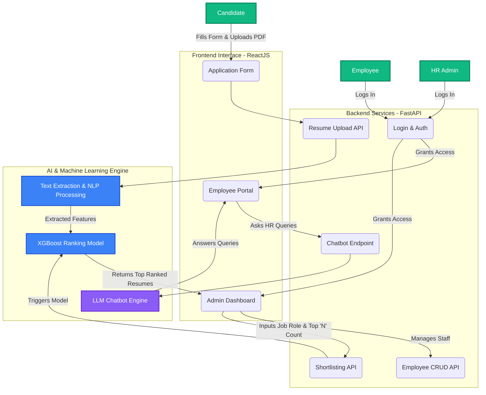

# Automated HR System

Welcome to the Automated HR System! This project is a comprehensive, web-based solution designed to streamline and automate various human resources tasks. It features a modern interface built with the MERN stack (MongoDB, Express.js, React, Node.js) and includes an intelligent chatbot to provide instant assistance to users.

## ✨ Features

*   **Employee Management:** Core HR functions for creating, viewing, updating, and deleting employee information.
*   **Recruitment Automation:** Tools to assist with managing job applications and the hiring process.
*   **Leave Management:** An intuitive system for employees to request time off and for managers to approve or deny requests.
*   **AI Chatbot:** An integrated, NLTK-based chatbot to answer common HR-related questions and guide users through the application.

## 🛠️ Tech Stack

*   **Frontend:** React.js
*   **Backend:** Node.js, Express.js
*   **Database:** MongoDB
*   **Chatbot:** Python, Flask, NLTK, TensorFlow

## 📂 Project Structure

```
Automated-HR-System/
├── mern-app/
│   ├── backend/
│   │   ├── chatbot/      # Python/Flask AI Chatbot
│   │   ├── controllers/  # Express route logic
│   │   ├── models/       # MongoDB data models
│   │   ├── routes/       # API routes
│   │   └── server.js     # Backend entry point
│   └── frontend/         # React frontend application
└── README.md
```

## 🚀 Getting Started

Follow these instructions to get a copy of the project up and running on your local machine for development and testing purposes.

### Prerequisites

Make sure you have the following software installed on your system:

*   [Node.js](https://nodejs.org/en/) (v14 or later recommended)
*   [npm](https://www.npmjs.com/) (comes with Node.js)
*   [Python](https://www.python.org/downloads/) (v3.8 or later recommended)
*   [MongoDB](https://www.mongodb.com/try/download/community) (or a MongoDB Atlas account)
*   [Git](https://git-scm.com/)

### Installation & Setup

1.  **Clone the repository:**
    ```sh
    git clone <https://github.com/muhammadmugheesahmed/Automated-HR-System.git>
    cd Automated-HR-System
    ```

2.  **Set up the Backend (Node.js):**
    *   Navigate to the backend directory:
        ```sh
        cd mern-app/backend
        ```
    *   Install npm dependencies:
        ```sh
        npm install
        ```
    *   Create a `.env` file in the `mern-app/backend` directory and add your environment variables.
        ```env
        # .env
        PORT=5000
        MONGO_URI=your_mongodb_connection_string
        JWT_SECRET=your_jwt_secret_key
        ```

3.  **Set up the Frontend (React):**
    *   Navigate to the frontend directory from the project root:
        ```sh
        cd mern-app/frontend
        ```
    *   Install npm dependencies:
        ```sh
        npm install
        ```

4.  **Set up the Chatbot (Python):**
    *   Navigate to the chatbot directory from the project root:
        ```sh
        cd mern-app/backend/chatbot
        ```
    *   Create and activate a Python virtual environment:
        ```sh
        # For Windows
        python -m venv venv
        .\venv\Scripts\activate

        # For macOS/Linux
        python3 -m venv venv
        source venv/bin/activate
        ```
    *   Install the required Python packages:
        ```sh
        pip install -r requirements.txt
        ```

### Running the Application

1.  **Start MongoDB:** Make sure your MongoDB database server is running.
2.  **Start the Backend Server:** In the `mern-app/backend` directory, run:
    ```sh
    npm install
    npm start
    ```
    Your Node.js server should now be running on `http://localhost:5000`.

3.  **Start the Frontend Server:** In a new terminal, from the `mern-app/frontend` directory, run:
    ```sh
    npm install
    npm run dev
    ```
    Your React application should now be running and open in your browser at `http://localhost:5173`.

4.  **Start the Chatbot Server:** In another new terminal, from the `mern-app/backend/chatbot` directory (with the virtual environment activated), run:
    ```sh
    python chatbot_api.py  # Or your main Python script
    ```
    Your Flask chatbot server will be running, typically on `http://localhost:5001`.

 ## 🏗️ System Architecture Spotlight

**Automated HR & Resume Screening System**
*A role-based architectural overview of my intelligent recruitment platform, detailing how Candidates, Employees, and Admins interact with the React frontend, FastAPI backend, and core AI models.*


